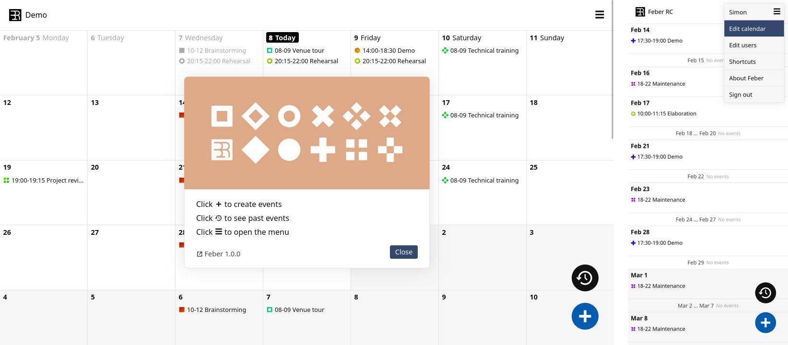

<!--
Ohart ongi: README hau automatikoki sortu da <https://github.com/YunoHost/apps/tree/master/tools/readme_generator>ri esker
EZ editatu eskuz.
-->

# Feber YunoHost-erako

[](https://ci-apps.yunohost.org/ci/apps/feber/)  

[](https://install-app.yunohost.org/?app=feber)

*[Irakurri README hau beste hizkuntzatan.](./ALL_README.md)*

> *Pakete honek Feber YunoHost zerbitzari batean azkar eta zailtasunik gabe instalatzea ahalbidetzen dizu.*  
> *YunoHost ez baduzu, kontsultatu [gida](https://yunohost.org/install) nola instalatu ikasteko.*

## Aurreikuspena


### Features

    File-based and database-free - trivial to setup, backup and transfer
    Event booking, easy repetition of events
    User management (four permission levels from read-only up to admin)
    Anonymous viewing/editing link option
    ics/ical subscription link option
    Automatic dark/light theme
    Customize calendar title and start of week (Monday/Sunday)


**Paketatutako bertsioa:** 1.1.1~ynh1

**Demoa:** <https://simonrepp.com/feber/demo/>

## Pantaila-argazkiak



## Dokumentazioa eta baliabideak

- Aplikazioaren webgune ofiziala: <https://simonrepp.com/feber/>
- Jatorrizko aplikazioaren kode-gordailua: <https://codeberg.org/simonrepp/feber>
- YunoHost Denda: <https://apps.yunohost.org/app/feber>
- Eman errore baten berri: <https://github.com/YunoHost-Apps/feber_ynh/issues>

## Garatzaileentzako informazioa

Bidali `pull request`a [`testing` abarrera](https://github.com/YunoHost-Apps/feber_ynh/tree/testing).

`testing` abarra probatzeko, ondorengoa egin:

```bash
sudo yunohost app install https://github.com/YunoHost-Apps/feber_ynh/tree/testing --debug
edo
sudo yunohost app upgrade feber -u https://github.com/YunoHost-Apps/feber_ynh/tree/testing --debug
```

**Informazio gehiago aplikazioaren paketatzeari buruz:** <https://yunohost.org/packaging_apps>
