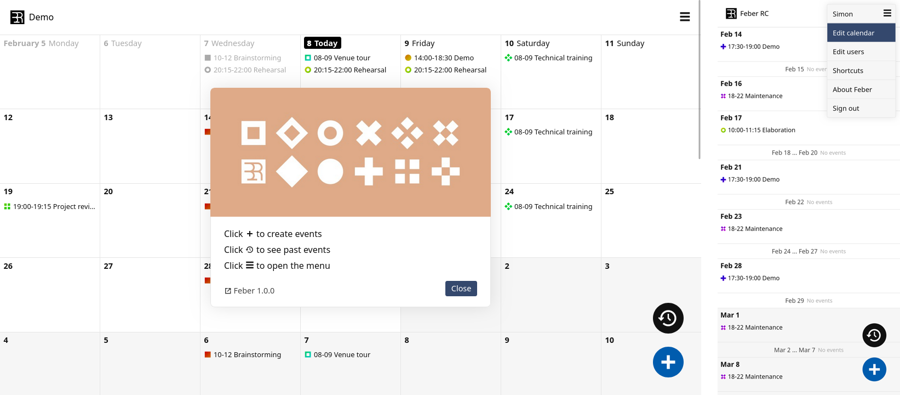

<!--
Nota bene : ce README est automatiquement généré par <https://github.com/YunoHost/apps/tree/master/tools/readme_generator>
Il NE doit PAS être modifié à la main.
-->

# Feber pour YunoHost

[](https://ci-apps.yunohost.org/ci/apps/feber/)  

[](https://install-app.yunohost.org/?app=feber)

*[Lire le README dans d'autres langues.](./ALL_README.md)*

> *Ce package vous permet d’installer Feber rapidement et simplement sur un serveur YunoHost.*  
> *Si vous n’avez pas YunoHost, consultez [ce guide](https://yunohost.org/install) pour savoir comment l’installer et en profiter.*

## Vue d’ensemble

Feber est un calendrier de groupe simple et auto-hébergé.

### Fonctionnalités

- Basé sur des fichiers et sans base de données - facile à configurer, sauvegarder et transférer
- Réservation d'événements, répétition facile des événements
- Gestion des utilisateurs (quatre niveaux d'autorisation de lecture seule à administrateur)
- Option de lien de visualisation/modification anonyme
- Option de lien d'abonnement ics/ical
- Thème sombre/clair automatique
- Personnaliser le titre du calendrier et le début de la semaine (lundi/dimanche)

**Version incluse :** 1.1.2~ynh1

**Démo :** <https://simonrepp.com/feber/demo/>

## Captures d’écran



## Documentations et ressources

- Site officiel de l’app : <https://simonrepp.com/feber/>
- Dépôt de code officiel de l’app : <https://codeberg.org/simonrepp/feber>
- YunoHost Store : <https://apps.yunohost.org/app/feber>
- Signaler un bug : <https://github.com/YunoHost-Apps/feber_ynh/issues>

## Informations pour les développeurs

Merci de faire vos pull request sur la [branche `testing`](https://github.com/YunoHost-Apps/feber_ynh/tree/testing).

Pour essayer la branche `testing`, procédez comme suit :

```bash
sudo yunohost app install https://github.com/YunoHost-Apps/feber_ynh/tree/testing --debug
ou
sudo yunohost app upgrade feber -u https://github.com/YunoHost-Apps/feber_ynh/tree/testing --debug
```

**Plus d’infos sur le packaging d’applications :** <https://yunohost.org/packaging_apps>
