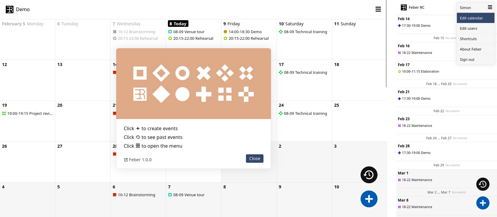

<!--
To README zostało automatycznie wygenerowane przez <https://github.com/YunoHost/apps/tree/master/tools/readme_generator>
Nie powinno być ono edytowane ręcznie.
-->

# Feber dla YunoHost

[](https://ci-apps.yunohost.org/ci/apps/feber/)


[](https://install-app.yunohost.org/?app=feber)

*[Przeczytaj plik README w innym języku.](./ALL_README.md)*

> *Ta aplikacja pozwala na szybką i prostą instalację Feber na serwerze YunoHost.*  
> *Jeżeli nie masz YunoHost zapoznaj się z [poradnikiem](https://yunohost.org/install) instalacji.*

## Przegląd

Feber is a simple, self-hostable group calendar.

### Features

- File-based and database-free - trivial to setup, backup and transfer
- Event booking, easy repetition of events
- User management (four permission levels from read-only up to admin)
- Anonymous viewing/editing link option
- ics/ical subscription link option
- Automatic dark/light theme
- Customize calendar title and start of week (Monday/Sunday)


**Dostarczona wersja:** 1.2.5~ynh2

**Demo:** <https://simonrepp.com/feber/demo/>

## Zrzuty ekranu



## Dokumentacja i zasoby

- Oficjalna strona aplikacji: <https://simonrepp.com/feber/>
- Repozytorium z kodem źródłowym: <https://codeberg.org/simonrepp/feber>
- Sklep YunoHost: <https://apps.yunohost.org/app/feber>
- Zgłaszanie błędów: <https://github.com/YunoHost-Apps/feber_ynh/issues>

## Informacje od twórców

Wyślij swój pull request do [gałęzi `testing`](https://github.com/YunoHost-Apps/feber_ynh/tree/testing).

Aby wypróbować gałąź `testing` postępuj zgodnie z instrukcjami:

```bash
sudo yunohost app install https://github.com/YunoHost-Apps/feber_ynh/tree/testing --debug
lub
sudo yunohost app upgrade feber -u https://github.com/YunoHost-Apps/feber_ynh/tree/testing --debug
```

**Więcej informacji o tworzeniu paczek aplikacji:** <https://yunohost.org/packaging_apps>
